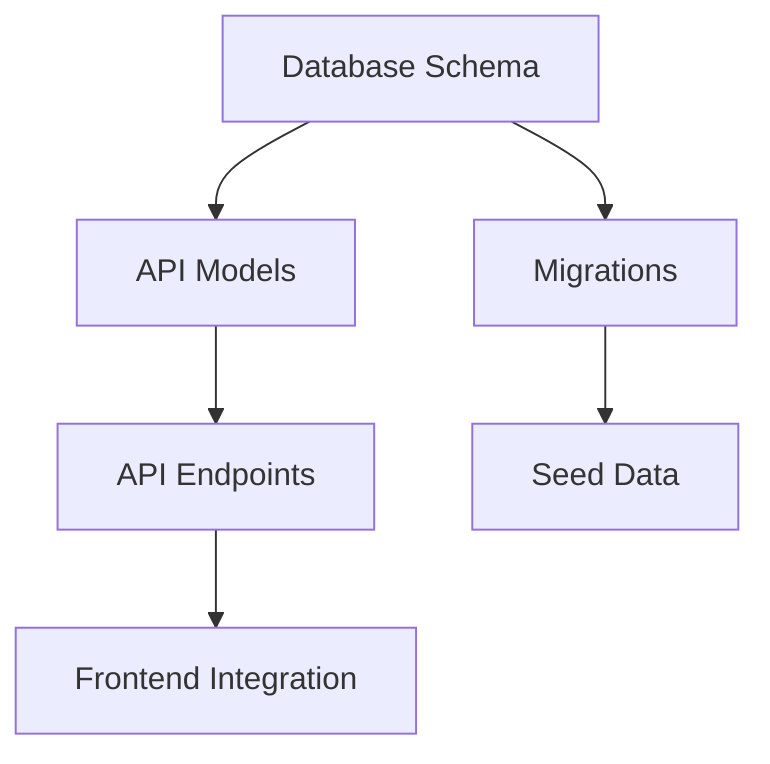

# AID Implementation Plan Skill (Phase 3)

Phase 3 is the bridge between design and development. This skill ensures all planning artifacts are consistent, consolidated, and ready for development.

---

## 🚀 PHASE 3 ENTRY - MANDATORY WELCOME MESSAGE

**When user enters Phase 3, Claude MUST display this message FIRST:**

```
╭─────────────────────────────────────────────────────────────╮
│                                                             │
│  🎯 Welcome to Phase 3: Implementation Planning             │
│                                                             │
│  Phase 3 is all about creating ONE SOURCE OF TRUTH!        │
│                                                             │
│  Before we can break down tasks and create Jira issues,    │
│  we need to consolidate all your planning documents into   │
│  a single, comprehensive specification.                     │
│                                                             │
│  ─────────────────────────────────────────────────────────  │
│                                                             │
│  📄 Documents I'll consolidate:                             │
│                                                             │
│     1. Research Report (if exists) - Phase 0 findings      │
│     2. PRD - Your product requirements from Phase 1        │
│     3. Tech Spec - Technical design from Phase 2           │
│                                                             │
│  ─────────────────────────────────────────────────────────  │
│                                                             │
│  🔍 What I'll do:                                          │
│                                                             │
│     • Read each document SECTION BY SECTION                │
│     • Find ALL contradictions between documents            │
│     • Resolve conflicts using this hierarchy:              │
│         Research > PRD > Tech Spec                         │
│     • Create ONE consolidated document (can be long!)      │
│     • NO information will be lost                          │
│                                                             │
│  ─────────────────────────────────────────────────────────  │
│                                                             │
│  ⚠️  This is a BIG task - the consolidated document will   │
│     contain EVERYTHING from all source documents.          │
│                                                             │
│  Ready to begin the consolidation process?                 │
│                                                             │
│  Reply: "yes, begin" or ask questions first                │
│                                                             │
╰─────────────────────────────────────────────────────────────╯
```

**Claude MUST wait for user confirmation before proceeding.**

---

## CRITICAL: Phase 3 Sub-Phase Structure

Phase 3 is divided into **three mandatory sub-phases**. Each must complete before proceeding.

```
┌─────────────────────────────────────────────────────────────────┐
│                         PHASE 3                                 │
├─────────────────────────────────────────────────────────────────┤
│                                                                 │
│  Phase 3a              Phase 3b              Phase 3c           │
│  ┌──────────────┐     ┌──────────────┐     ┌──────────────┐    │
│  │ Consolidation│────►│ Task         │────►│ Jira         │    │
│  │ & Validation │     │ Breakdown    │     │ Population   │    │
│  └──────────────┘     └──────────────┘     └──────────────┘    │
│         │                    │                    │             │
│         ▼                    ▼                    ▼             │
│  [User Approval]      [Milestone]          [Final Review]       │
│                                                                 │
└─────────────────────────────────────────────────────────────────┘
```

---

## Phase 3a: Consolidation & Validation

### Purpose
Resolve all contradictions between PRD, Tech Spec, and Research before any planning begins.

### CRITICAL: Section-by-Section Processing

**WHY SECTION-BY-SECTION?**
- Source documents are LARGE (PRD + Tech Spec + Research)
- Processing all at once will cause information loss
- Dependencies between sections must be tracked
- Each section needs focused contradiction analysis

### Process

#### Step 1: Document Discovery & Section Mapping

First, Claude MUST read and map ALL sections from each document:

```
┌─────────────────────────────────────────────────────────────────┐
│ DOCUMENT SECTION MAPPING                                        │
├─────────────────────────────────────────────────────────────────┤
│                                                                 │
│ Research Report (if exists):                                    │
│ ├── Section 1: [Title]                                         │
│ ├── Section 2: [Title]                                         │
│ └── Section N: [Title]                                         │
│                                                                 │
│ PRD:                                                            │
│ ├── Section 1: [Title] ──────────┐                             │
│ ├── Section 2: [Title] ──────────┼── Dependencies              │
│ ├── Section 3: [Title] ◄─────────┘                             │
│ └── Section N: [Title]                                         │
│                                                                 │
│ Tech Spec:                                                      │
│ ├── Section 1: [Title] ──► Related to PRD Section [X]          │
│ ├── Section 2: [Title] ──► Related to PRD Section [Y]          │
│ └── Section N: [Title]                                         │
│                                                                 │
│ Cross-Document Dependencies:                                    │
│ • PRD Section 3 depends on PRD Section 2                       │
│ • Tech Spec Section 1 implements PRD Section 1                 │
│ • Tech Spec Section 4 references Research Section 2            │
│                                                                 │
└─────────────────────────────────────────────────────────────────┘
```

**Show this mapping to user and confirm before proceeding.**

#### Step 2: Create Processing Order

Based on dependencies, create the consolidation order:

```yaml
consolidation_order:
  # Process in dependency order - foundations first

  round_1_foundations:
    - research_section: "Market Analysis"
      related_prd: null
      related_tech: null
    - prd_section: "Problem Statement"
      related_research: "Market Analysis"
      related_tech: null

  round_2_requirements:
    - prd_section: "User Stories"
      depends_on: ["Problem Statement"]
      related_tech: "Component Design"
    - prd_section: "Acceptance Criteria"
      depends_on: ["User Stories"]
      related_tech: "API Contracts"

  round_3_technical:
    - tech_section: "Architecture"
      depends_on: ["User Stories"]
      related_prd: "Non-Functional Requirements"
    - tech_section: "Data Models"
      depends_on: ["Architecture"]
      related_prd: "User Stories"

  round_4_implementation:
    - tech_section: "API Contracts"
      depends_on: ["Data Models"]
      related_prd: "Acceptance Criteria"
    - tech_section: "Security"
      depends_on: ["Architecture", "API Contracts"]
      related_prd: "Non-Functional Requirements"
```

#### Step 3: Section-by-Section Consolidation

**For EACH section in processing order:**

```
╭─────────────────────────────────────────────────────────────╮
│ 📖 PROCESSING SECTION: [Section Name]                       │
├─────────────────────────────────────────────────────────────┤
│                                                             │
│ Source: [PRD/Tech Spec/Research]                           │
│ Related Sections:                                           │
│   • [Document]: [Section] - [Relationship]                 │
│                                                             │
│ ─────────────────────────────────────────────────────────   │
│                                                             │
│ Content from this section:                                  │
│ [Full section content]                                      │
│                                                             │
│ ─────────────────────────────────────────────────────────   │
│                                                             │
│ Contradictions found with related sections:                 │
│                                                             │
│ ⚠️ Contradiction #1:                                       │
│    PRD says: "[text]"                                       │
│    Tech Spec says: "[text]"                                 │
│    Resolution: [Using PRD because...]                       │
│                                                             │
│ ✓ No contradictions with: [list sections]                  │
│                                                             │
│ ─────────────────────────────────────────────────────────   │
│                                                             │
│ Consolidated output for this section: [preview]             │
│                                                             │
│ Continue to next section? [yes/pause]                       │
│                                                             │
╰─────────────────────────────────────────────────────────────╯
```

**Claude processes sections ONE AT A TIME, showing progress.**

#### Step 4: Contradiction Analysis (Per Section)

| Contradiction Type | Example | Resolution Priority |
|-------------------|---------|---------------------|
| **Scope conflicts** | PRD says "mobile-first", Tech Spec is desktop-only | 1 (Critical) |
| **Technical conflicts** | Different API designs for same feature | 1 (Critical) |
| **Requirement gaps** | PRD feature missing from Tech Spec | 2 (High) |
| **Implementation conflicts** | Different approaches to same problem | 2 (High) |
| **Minor inconsistencies** | Naming differences, format variations | 3 (Low) |

#### Step 5: Resolution Hierarchy

**Resolution Authority (in order):**

```
1. Research Report (if exists)
   └── Data-driven findings override assumptions

2. PRD (Source of Truth)
   └── Business requirements take precedence

3. Tech Spec
   └── Technical constraints inform implementation
```

**Resolution Template (logged for each):**
```markdown
## Contradiction #[N]

**Found In:** [PRD section] vs [Tech Spec section]
**Description:** [What conflicts]
**Resolution:** [How resolved]
**Authority Used:** [Research/PRD/Tech Spec]
**Rationale:** [Why this decision]
**Preserved Original Text:**
- PRD: "[original]"
- Tech Spec: "[original]"
```

#### Step 6: Progressive Document Building

As each section is processed, Claude WRITES to the consolidated document:

```
After processing Section 1:
  → Write Section 1 to consolidated-spec.md

After processing Section 2:
  → Append Section 2 to consolidated-spec.md
  → Update cross-references if needed

After processing Section N:
  → Append Section N to consolidated-spec.md
  → Final cross-reference check
  → Generate table of contents
```

**This ensures NO information is lost even if context is long.**

### Progress Tracking

Claude MUST show progress after each section:

```
╭─────────────────────────────────────────────────────────────╮
│ 📊 CONSOLIDATION PROGRESS                                   │
├─────────────────────────────────────────────────────────────┤
│                                                             │
│  Sections Processed: [X] of [Total]                         │
│  ████████████░░░░░░░░░░░░░░░░░░░░░░░░  35%                 │
│                                                             │
│  Completed:                                                 │
│  ✓ Problem Statement                                        │
│  ✓ User Stories                                             │
│  ✓ Architecture Overview                                    │
│                                                             │
│  In Progress:                                               │
│  → Data Models                                              │
│                                                             │
│  Remaining:                                                 │
│  ○ API Contracts                                            │
│  ○ Security                                                 │
│  ○ Testing Strategy                                         │
│                                                             │
│  Contradictions Found: [N] (all resolved)                   │
│  Current Document Size: [X] words                           │
│                                                             │
╰─────────────────────────────────────────────────────────────╯
```

### Phase 3a Checkpoint

```
╭─────────────────────────────────────────────────────────────╮
│ PHASE 3a CHECKPOINT: Consolidation Complete                 │
├─────────────────────────────────────────────────────────────┤
│                                                             │
│  Documents Analyzed:                                        │
│  ✓ PRD: [path] ([X] sections)                              │
│  ✓ Tech Spec: [path] ([Y] sections)                        │
│  ✓ Research: [path or N/A] ([Z] sections)                  │
│                                                             │
│  Total Sections Processed: [N]                              │
│                                                             │
│  Contradictions Found: [N]                                  │
│  ├── Critical: [count] - ALL RESOLVED                      │
│  ├── High: [count] - ALL RESOLVED                          │
│  └── Low: [count] - ALL RESOLVED                           │
│                                                             │
│  Consolidated Document:                                     │
│  📄 [path]                                                  │
│  📏 [word count] words                                      │
│  📑 [section count] sections                                │
│                                                             │
│  Information Verification:                                  │
│  ✓ All PRD sections included                               │
│  ✓ All Tech Spec sections included                         │
│  ✓ All Research findings included                          │
│  ✓ No information lost                                      │
│                                                             │
│  ─────────────────────────────────────────────────────────  │
│                                                             │
│  ⚠️  USER APPROVAL REQUIRED                                │
│                                                             │
│  Please review the consolidated document and confirm:       │
│                                                             │
│  Reply: "approve consolidation" to proceed to task breakdown│
│  Reply: "show section [X]" to review a specific section    │
│  Reply: "change [X]" to request modifications              │
│                                                             │
╰─────────────────────────────────────────────────────────────╯
```

**CRITICAL: Cannot proceed to Phase 3b without user approval.**

---

## Phase 3b: Task Breakdown

### 🚀 PHASE 3b ENTRY - MANDATORY MESSAGE AFTER CONSOLIDATION APPROVAL

**When user approves the consolidated document, Claude MUST display:**

```
╭─────────────────────────────────────────────────────────────╮
│                                                             │
│  ✅ Consolidated Document Approved!                         │
│                                                             │
│  Great! Now we have our SINGLE SOURCE OF TRUTH.            │
│                                                             │
│  ─────────────────────────────────────────────────────────  │
│                                                             │
│  📋 NEXT STEP: High-Level Task Breakdown                   │
│                                                             │
│  Now I'm going to create a HIGH-LEVEL breakdown of all     │
│  the work that needs to be done:                           │
│                                                             │
│     • Epics (major feature areas)                          │
│     • Stories (user-facing functionality)                  │
│     • Tasks (technical work items)                         │
│     • Subtasks (atomic work units)                         │
│                                                             │
│  ─────────────────────────────────────────────────────────  │
│                                                             │
│  🔄 THE PROCESS:                                           │
│                                                             │
│     Step 1: Create the breakdown structure                 │
│             (Epics → Stories → Tasks → Subtasks)           │
│                                                             │
│     Step 2: You review and approve the structure           │
│                                                             │
│     Step 3: Enter structure into Jira (or export)          │
│             (Creates the issue hierarchy FIRST)            │
│                                                             │
│     Step 4: Enhance each Jira issue with FULL details      │
│             (Adds all info from consolidated spec)         │
│                                                             │
│  ─────────────────────────────────────────────────────────  │
│                                                             │
│  💡 WHY THIS ORDER?                                        │
│                                                             │
│     Creating the Jira structure FIRST, then enhancing,     │
│     ensures we don't miss any tasks and can track          │
│     progress step-by-step through the full development.    │
│                                                             │
│  Ready to create the high-level breakdown?                 │
│                                                             │
│  Reply: "yes, create breakdown" to proceed                 │
│                                                             │
╰─────────────────────────────────────────────────────────────╯
```

**Claude MUST wait for user confirmation before proceeding.**

### Purpose
Transform the consolidated specification into actionable development tasks.

### Process

#### Step 1: Component Identification

Extract all implementable components from consolidated spec:

```
Component Categories:
├── Backend
│   ├── API Endpoints
│   ├── Database Models
│   ├── Business Logic
│   └── Integrations
├── Frontend
│   ├── Pages/Views
│   ├── Components
│   ├── State Management
│   └── API Integration
├── Infrastructure
│   ├── Database Setup
│   ├── Environment Config
│   └── CI/CD
└── Cross-Cutting
    ├── Authentication
    ├── Authorization
    ├── Logging/Monitoring
    └── Error Handling
```

#### Step 2: Task Decomposition Rules

| Rule | Requirement |
|------|-------------|
| **Size** | Each task < 4 hours (prefer 1-2 hours) |
| **Independence** | Task should be completable without other tasks (unless dependency) |
| **Testability** | Task has clear acceptance criteria |
| **Traceability** | Task links to consolidated spec section |

#### Step 3: Estimation Guidelines

| Issue Type | Estimation Unit | Typical Range |
|------------|-----------------|---------------|
| Epic | Sprints | 1-3 sprints |
| Story | Story Points (Fibonacci) | 1, 2, 3, 5, 8, 13 |
| Task | Hours | 1-8 hours |
| Subtask | Minutes/Hours | 15 min - 4 hours |

#### Step 4: Dependency Mapping



Claude MUST:
- Identify blocking dependencies
- Mark critical path
- Flag parallel workstreams

#### Step 5: Sprint/Agile Planning

If using sprints:

```yaml
sprint_planning:
  sprint_length: [days]
  team_capacity: [story points or hours]
  velocity_reference: [historical or estimated]

  sprint_1:
    goal: "[Sprint goal]"
    stories: [list]
    total_points: [N]

  sprint_2:
    goal: "[Sprint goal]"
    stories: [list]
    total_points: [N]
```

#### Step 6: Risk Assessment

| Risk Category | Examples | Mitigation Required |
|---------------|----------|---------------------|
| **Technical** | New technology, complex integration | Yes |
| **Dependency** | External API, third-party service | Yes |
| **Resource** | Skill gaps, availability | Yes |
| **Timeline** | Hard deadlines, dependencies | Yes |
| **Scope** | Unclear requirements | Flag for clarification |

**Risk Template:**
```markdown
### Risk: [Name]
- **Category:** [Technical/Dependency/Resource/Timeline/Scope]
- **Probability:** [High/Medium/Low]
- **Impact:** [High/Medium/Low]
- **Mitigation:** [Strategy]
- **Contingency:** [Backup plan]
- **Owner:** [Role responsible]
```

### Phase 3b Checkpoint

```
╭─────────────────────────────────────────────────────────────╮
│ PHASE 3b CHECKPOINT: Task Breakdown Complete                │
├─────────────────────────────────────────────────────────────┤
│                                                             │
│  Task Summary:                                              │
│  ├── Epics: [count]                                        │
│  ├── Stories: [count]                                      │
│  ├── Tasks: [count]                                        │
│  └── Subtasks: [count]                                     │
│                                                             │
│  Estimation Summary:                                        │
│  ├── Total Story Points: [N]                               │
│  ├── Total Hours: [N]                                      │
│  └── Estimated Sprints: [N]                                │
│                                                             │
│  Dependencies:                                              │
│  ├── Critical Path Items: [count]                          │
│  └── Parallel Workstreams: [count]                         │
│                                                             │
│  Risks Identified: [count]                                  │
│  ├── High: [count]                                         │
│  ├── Medium: [count]                                       │
│  └── Low: [count]                                          │
│                                                             │
│  ─────────────────────────────────────────────────────────  │
│                                                             │
│  Breakdown document saved to:                               │
│  📄 docs/implementation-plan/task-breakdown-YYYY-MM-DD.md  │
│                                                             │
│  Ready for Phase 3c: Jira Population                       │
│                                                             │
╰─────────────────────────────────────────────────────────────╯
```

---

## Phase 3c: Jira Population

### 🚀 PHASE 3c ENTRY - MANDATORY JIRA QUESTION

**After task breakdown is complete, Claude MUST ask:**

```
╭─────────────────────────────────────────────────────────────╮
│                                                             │
│  📋 Task Breakdown Complete!                                │
│                                                             │
│  Now it's time to create the full project structure        │
│  so we can track every task and never miss anything.       │
│                                                             │
│  ─────────────────────────────────────────────────────────  │
│                                                             │
│  🔧 Do you have Jira set up for this project?              │
│                                                             │
│  ─────────────────────────────────────────────────────────  │
│                                                             │
│  If YES (Jira available):                                   │
│                                                             │
│     I'll do this in TWO steps:                             │
│                                                             │
│     STEP 1: Create the Jira STRUCTURE                      │
│             • Create all Epics                             │
│             • Create all Stories under Epics               │
│             • Create all Tasks under Stories               │
│             • Create all Subtasks under Tasks              │
│             • Link all dependencies                        │
│                                                             │
│     STEP 2: ENHANCE each issue with FULL details           │
│             • Add complete descriptions                    │
│             • Add business context from PRD                │
│             • Add technical notes from Tech Spec           │
│             • Add acceptance criteria                      │
│             • Add test strategy                            │
│             • Reference consolidated spec sections         │
│                                                             │
│  ─────────────────────────────────────────────────────────  │
│                                                             │
│  If NO (No Jira):                                          │
│                                                             │
│     I can export the breakdown to:                         │
│     • CSV file (for spreadsheet tracking)                  │
│     • JSON file (for import into other tools)              │
│                                                             │
│     ⚠️  RECOMMENDATION:                                    │
│                                                             │
│     For full SaaS development, we STRONGLY recommend       │
│     using Jira (or similar tool) because:                  │
│                                                             │
│     ✓ Never miss a task - everything is tracked           │
│     ✓ Step-by-step completion visibility                  │
│     ✓ Dependencies are enforced                           │
│     ✓ Progress dashboards                                 │
│     ✓ Sprint planning & velocity tracking                 │
│     ✓ Better team collaboration                           │
│                                                             │
│     Building a complete SaaS has HUNDREDS of tasks.        │
│     Without proper tracking, tasks WILL be forgotten.      │
│                                                             │
│  ─────────────────────────────────────────────────────────  │
│                                                             │
│  Please choose:                                             │
│                                                             │
│  Reply: "use jira" - I'll create structure then enhance   │
│  Reply: "export csv" - I'll create CSV file                │
│  Reply: "export json" - I'll create JSON file              │
│  Reply: "setup jira first" - Let's configure Jira MCP     │
│                                                             │
╰─────────────────────────────────────────────────────────────╯
```

**Claude MUST wait for user choice before proceeding.**

### Purpose
Create Jira issues with ALL information from the consolidated document.

### TWO-STEP JIRA POPULATION PROCESS

**CRITICAL: Structure FIRST, then Enhance.**

This ensures:
1. All tasks exist in Jira before we start enhancing
2. Dependencies can be properly linked
3. No tasks are forgotten during enhancement
4. Progress is visible immediately

---

### STEP 1: Create Jira Structure (Skeleton)

#### 1.1 Create All Epics First

```
For each Epic in breakdown:
  → Create Epic with:
     • Summary (title only)
     • Basic description (1-2 sentences)
     • Priority
     • Labels
  → Store Epic key for Story creation
```

**Progress Display:**
```
╭─────────────────────────────────────────────────────────────╮
│ 📦 Creating Jira Structure - STEP 1                        │
├─────────────────────────────────────────────────────────────┤
│                                                             │
│  Creating Epics...                                          │
│  ████████████████████████████████████████  100%            │
│                                                             │
│  ✓ PROJ-1: User Authentication Epic                       │
│  ✓ PROJ-2: Dashboard Epic                                 │
│  ✓ PROJ-3: Payment Integration Epic                       │
│                                                             │
│  Epics Created: 3 of 3                                     │
│                                                             │
╰─────────────────────────────────────────────────────────────╯
```

#### 1.2 Create All Stories Under Epics

```
For each Story in breakdown:
  → Create Story with:
     • Summary (title)
     • Parent Epic link
     • Story Points estimate
     • Priority
  → Store Story key for Task creation
```

#### 1.3 Create All Tasks Under Stories

```
For each Task in breakdown:
  → Create Task with:
     • Summary (title)
     • Parent Story link
     • Hour estimate
     • Priority
  → Store Task key for Subtask creation
```

#### 1.4 Create All Subtasks Under Tasks

```
For each Subtask in breakdown:
  → Create Subtask with:
     • Summary (title)
     • Parent Task link
     • Hour estimate
```

#### 1.5 Link All Dependencies

```
For each dependency in breakdown:
  → Create issue link:
     • "is blocked by" / "blocks"
     • Link source and target issues
```

**Structure Complete Display:**
```
╭─────────────────────────────────────────────────────────────╮
│ ✅ STEP 1 COMPLETE: Jira Structure Created                 │
├─────────────────────────────────────────────────────────────┤
│                                                             │
│  Issues Created:                                            │
│  ├── Epics: 3                                              │
│  │   ├── PROJ-1: User Authentication                       │
│  │   ├── PROJ-2: Dashboard                                 │
│  │   └── PROJ-3: Payment Integration                       │
│  ├── Stories: 12                                           │
│  ├── Tasks: 45                                             │
│  └── Subtasks: 89                                          │
│                                                             │
│  Dependencies Linked: 34                                    │
│                                                             │
│  ─────────────────────────────────────────────────────────  │
│                                                             │
│  The skeleton is ready! All issues exist in Jira.          │
│                                                             │
│  Now proceeding to STEP 2: Enhance with full details...   │
│                                                             │
╰─────────────────────────────────────────────────────────────╯
```

---

### STEP 2: Enhance Each Issue With Full Details

Now that all issues exist, enhance them ONE BY ONE with full information from the consolidated spec.

#### 2.1 Enhancement Process

```
For each issue (in hierarchy order):

  1. Read corresponding section from consolidated spec

  2. Update issue description with:
     • Full business context (from PRD)
     • Technical implementation details (from Tech Spec)
     • Acceptance criteria (complete list)
     • Technical notes & gotchas
     • Test strategy
     • Reference to consolidated spec section

  3. Show progress
```

#### 2.2 Enhancement Template

```markdown
## Summary
[What this issue accomplishes]

## Business Context
[Why this matters - from PRD section of consolidated spec]

## Technical Implementation
[How to implement - from Tech Spec section of consolidated spec]

## Acceptance Criteria
- [ ] [Criterion 1 - from consolidated spec]
- [ ] [Criterion 2 - from consolidated spec]
- [ ] [Criterion 3 - from consolidated spec]

## Technical Notes
[Implementation details, gotchas, considerations from Tech Spec]

## Dependencies
- Blocks: [issue keys - already linked]
- Blocked By: [issue keys - already linked]

## Test Strategy
[How this will be tested - from consolidated spec]

## Reference
📄 Consolidated Spec: [doc path]
📑 Section: [section name]
```

#### 2.3 Enhancement Progress Display

```
╭─────────────────────────────────────────────────────────────╮
│ 📝 STEP 2: Enhancing Issues With Full Details              │
├─────────────────────────────────────────────────────────────┤
│                                                             │
│  Progress: 23 of 149 issues enhanced                        │
│  ███████░░░░░░░░░░░░░░░░░░░░░░░░░░░░░░░░  15%              │
│                                                             │
│  Currently enhancing:                                       │
│  → PROJ-15: Implement password hashing                     │
│    Source: Consolidated Spec Section 4.2.1                 │
│                                                             │
│  Recently completed:                                        │
│  ✓ PROJ-14: Create user database schema                   │
│  ✓ PROJ-13: Design authentication flow                    │
│  ✓ PROJ-12: Define user data model                        │
│                                                             │
│  Remaining: 126 issues                                      │
│                                                             │
╰─────────────────────────────────────────────────────────────╯
```

---

### Alternative: CSV/JSON Export

If user chooses export instead of Jira:

#### CSV Export Format

```csv
Type,Key,Summary,Description,Parent,Story Points,Hours,Priority,Dependencies,Spec Reference
Epic,,User Authentication,"Full auth system",,,,High,,Section 4
Story,,[Epic] Login Flow,"User login",[Epic-1],5,,High,,[Epic] 4.1
Task,,[Story] Password hashing,"Bcrypt impl",[Story-1],,4,Medium,,[Story] 4.1.1
Subtask,,[Task] Add bcrypt lib,"npm install",[Task-1],,0.5,Low,,[Task] 4.1.1.1
```

#### JSON Export Format

```json
{
  "project": "[Feature Name]",
  "exported_at": "YYYY-MM-DD",
  "consolidated_spec": "path/to/consolidated-spec.md",
  "hierarchy": {
    "epics": [
      {
        "summary": "User Authentication",
        "description": "Full authentication system...",
        "spec_reference": "Section 4",
        "stories": [
          {
            "summary": "Login Flow",
            "story_points": 5,
            "spec_reference": "Section 4.1",
            "tasks": [...]
          }
        ]
      }
    ]
  }
}
```

**Export Complete Display:**
```
╭─────────────────────────────────────────────────────────────╮
│ 📁 Export Complete                                          │
├─────────────────────────────────────────────────────────────┤
│                                                             │
│  Files created:                                             │
│                                                             │
│  📄 docs/implementation-plan/jira-export-YYYY-MM-DD.csv    │
│  📄 docs/implementation-plan/jira-export-YYYY-MM-DD.json   │
│                                                             │
│  ─────────────────────────────────────────────────────────  │
│                                                             │
│  ⚠️  REMINDER:                                             │
│                                                             │
│  For better tracking during development, consider:         │
│                                                             │
│  • Import this into Jira, Trello, or Linear               │
│  • Use a spreadsheet with status columns                   │
│  • Set up the Jira MCP for automated tracking             │
│                                                             │
│  Run "/setup jira" when ready to configure Jira.          │
│                                                             │
╰─────────────────────────────────────────────────────────────╯
```

---

### Phase 3c Checkpoint (Final)

```
╭─────────────────────────────────────────────────────────────╮
│ PHASE 3c CHECKPOINT: Jira Population Complete               │
├─────────────────────────────────────────────────────────────┤
│                                                             │
│  Jira Issues Created & Enhanced:                            │
│  ├── Epics: [count] - [list keys]                          │
│  ├── Stories: [count]                                      │
│  ├── Tasks: [count]                                        │
│  └── Subtasks: [count]                                     │
│                                                             │
│  ─────────────────────────────────────────────────────────  │
│                                                             │
│  STEP 1 - Structure: ✅ Complete                           │
│  • All issues created                                       │
│  • All dependencies linked                                  │
│  • Hierarchy verified                                       │
│                                                             │
│  STEP 2 - Enhancement: ✅ Complete                         │
│  • All descriptions populated                               │
│  • All acceptance criteria added                            │
│  • All technical notes included                             │
│  • All spec references linked                               │
│                                                             │
│  ─────────────────────────────────────────────────────────  │
│                                                             │
│  Information Validation:                                    │
│  ✓ All issues have FULL descriptions                      │
│  ✓ All issues have acceptance criteria                     │
│  ✓ All issues have estimates                               │
│  ✓ All dependencies linked                                 │
│  ✓ All issues reference consolidated spec                  │
│                                                             │
│  Sprint Assignment:                                         │
│  ├── Sprint 1: [count] issues                              │
│  ├── Sprint 2: [count] issues                              │
│  └── Backlog: [count] issues                               │
│                                                             │
│  ═══════════════════════════════════════════════════════   │
│                                                             │
│  🎉 PHASE 3 COMPLETE!                                      │
│                                                             │
│  You now have:                                              │
│  ✓ ONE consolidated source of truth                        │
│  ✓ Complete task breakdown                                 │
│  ✓ Full Jira structure with detailed issues               │
│  ✓ Every task traceable to requirements                   │
│                                                             │
│  Ready for Phase 4 (Development)!                          │
│                                                             │
│  Run: /aid-start to begin development                      │
│                                                             │
╰─────────────────────────────────────────────────────────────╯
```

---

## Output Artifacts

### Required Documents

| Artifact | Location | Format |
|----------|----------|--------|
| Consolidated Spec | `docs/implementation-plan/consolidated-spec-YYYY-MM-DD-[feature].md` | Markdown |
| Contradiction Log | `docs/implementation-plan/contradiction-log-YYYY-MM-DD.md` | Markdown |
| Task Breakdown | `docs/implementation-plan/task-breakdown-YYYY-MM-DD-[feature].md` | Markdown |
| Jira Export | `docs/implementation-plan/jira-export-YYYY-MM-DD.json` | JSON |
| Risk Assessment | `docs/implementation-plan/risks-YYYY-MM-DD.md` | Markdown |
| Sprint Plan | `docs/implementation-plan/sprint-plan-YYYY-MM-DD.yaml` | YAML |

### Machine-Readable Output

All documents have companion JSON/YAML files for automation:

```
docs/implementation-plan/
├── consolidated-spec-2024-12-15-user-auth.md
├── consolidated-spec-2024-12-15-user-auth.json    # Machine-readable
├── task-breakdown-2024-12-15-user-auth.md
├── task-breakdown-2024-12-15-user-auth.json       # Machine-readable
├── sprint-plan-2024-12-15.yaml                    # Machine-readable
└── risks-2024-12-15.yaml                          # Machine-readable
```

---

## Exit Criteria (Phase 3 → Phase 4)

### Mandatory Checklist

- [ ] **Phase 3a Complete**
  - [ ] All input documents analyzed (PRD, Tech Spec, Research)
  - [ ] All contradictions identified and resolved
  - [ ] Consolidated master document created
  - [ ] User approved consolidation

- [ ] **Phase 3b Complete**
  - [ ] All tasks broken down (< 4 hours each)
  - [ ] All tasks have acceptance criteria
  - [ ] Dependencies mapped with critical path
  - [ ] Risk assessment complete with mitigations
  - [ ] Sprint/iteration plan defined

- [ ] **Phase 3c Complete**
  - [ ] Jira issues created (or export file ready)
  - [ ] All issues have full descriptions from consolidated spec
  - [ ] All issues have estimates
  - [ ] Dependencies linked between issues
  - [ ] Issues assigned to sprints

- [ ] **Quality Gates**
  - [ ] Sub-agent review PASSED
  - [ ] User feedback collected via `/aid end`

---

## Commands

| Command | Purpose |
|---------|---------|
| `/impl-plan` | Start Phase 3 workflow |
| `/consolidate` | Run Phase 3a consolidation |
| `/breakdown` | Run Phase 3b task breakdown |
| `/populate-jira` | Run Phase 3c Jira population |
| `/phase 3a` | Check Phase 3a status |
| `/phase 3b` | Check Phase 3b status |
| `/phase 3c` | Check Phase 3c status |

---

## Integration with Other Skills

| Skill | Integration Point |
|-------|-------------------|
| `phase-enforcement` | Validates sub-phase transitions |
| `system-architect` | Tech Spec input for Phase 3a |
| `aid-prd` | PRD input for Phase 3a |
| `test-driven` | Test strategy feeds into Phase 3b tasks |
| `code-review` | Task structure informs review scope |

---

## State Tracking

Phase 3 uses extended state in `.aid/state.json`:

```json
{
  "current_phase": 3,
  "phase_name": "Implementation Plan",
  "sub_phase": "3b",
  "sub_phase_name": "Task Breakdown",
  "phase_3_state": {
    "3a": {
      "status": "complete",
      "contradictions_found": 5,
      "contradictions_resolved": 5,
      "consolidated_doc": "docs/implementation-plan/consolidated-spec-2024-12-15-user-auth.md",
      "user_approved": true,
      "approved_at": "2024-12-15T10:00:00Z"
    },
    "3b": {
      "status": "in_progress",
      "tasks_created": 24,
      "risks_identified": 3,
      "sprint_plan_ready": false
    },
    "3c": {
      "status": "locked",
      "jira_issues_created": 0
    }
  }
}
```
