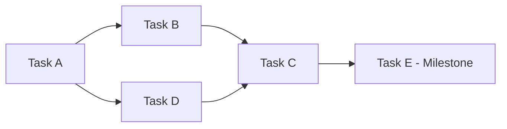

# Task Breakdown: [Feature Name]

**Date:** YYYY-MM-DD
**Consolidated Spec:** `docs/implementation-plan/consolidated-spec-YYYY-MM-DD-[feature].md`
**Status:** [Draft | Ready for Jira]

---

## Summary

| Metric | Value |
|--------|-------|
| Total Epics | [N] |
| Total Stories | [N] |
| Total Tasks | [N] |
| Total Subtasks | [N] |
| Total Story Points | [N] |
| Total Hours | [N] |
| Estimated Sprints | [N] |

---

## Sprint Overview

### Sprint 1: [Sprint Goal]

**Capacity:** [X] story points
**Focus:** [What this sprint accomplishes]

| Issue | Type | Points | Priority |
|-------|------|--------|----------|
| [KEY-001] | Story | [N] | [P1/P2/P3] |
| [KEY-002] | Story | [N] | [P1/P2/P3] |

### Sprint 2: [Sprint Goal]

**Capacity:** [X] story points
**Focus:** [What this sprint accomplishes]

| Issue | Type | Points | Priority |
|-------|------|--------|----------|
| [KEY-010] | Story | [N] | [P1/P2/P3] |

<!-- Repeat for each sprint -->

---

## Critical Path

**Critical Path Items:**
1. [Task A] - [Why critical]
2. [Task B] - [Why critical]
3. [Task C] - [Why critical]

**Parallel Workstreams:**
- Stream 1: [Tasks that can run in parallel]
- Stream 2: [Tasks that can run in parallel]

---

## Epic Breakdown

### Epic: [EPIC-001] [Epic Title]

**Description:** [From consolidated spec]
**Business Value:** [Why this matters]
**Spec Reference:** Consolidated Spec Section [X]

| Field | Value |
|-------|-------|
| Estimated Sprints | [N] |
| Total Story Points | [N] |
| Stories | [N] |
| Priority | [P1/P2/P3] |

---

#### Story: [STORY-001] [Story Title]

**User Story:**
As a [persona], I want [capability], so that [benefit].

**Spec Reference:** Consolidated Spec Section [X.Y]

**Acceptance Criteria:**
- [ ] [Criterion 1]
- [ ] [Criterion 2]
- [ ] [Criterion 3]

**Story Points:** [N]
**Priority:** [P1/P2/P3]
**Sprint:** [Sprint N]

**Dependencies:**
- Blocked by: [None / STORY-XXX]
- Blocks: [None / STORY-XXX]

##### Tasks

| Task ID | Title | Hours | Assignee | Status |
|---------|-------|-------|----------|--------|
| TASK-001 | [Title] | [N] | [Role] | [ ] |
| TASK-002 | [Title] | [N] | [Role] | [ ] |

---

##### Task: [TASK-001] [Task Title]

**Description:**
[Detailed description of what to implement]

**Technical Notes:**
[From Tech Spec section of consolidated spec]

**Acceptance Criteria:**
- [ ] [Criterion 1]
- [ ] [Criterion 2]

**Estimated Hours:** [N]
**Spec Reference:** Consolidated Spec Section [X.Y.Z]

**Subtasks:**

| Subtask | Description | Hours |
|---------|-------------|-------|
| 1 | [Description] | [N] |
| 2 | [Description] | [N] |
| 3 | [Description] | [N] |

**Test Requirements:**
- Unit test: [What to test]
- Integration test: [What to test]

<!-- Repeat Task structure for each task -->

---

<!-- Repeat Story structure for each story -->

---

<!-- Repeat Epic structure for each epic -->

---

## Dependency Matrix

| Task | Depends On | Depended By |
|------|------------|-------------|
| TASK-001 | - | TASK-002, TASK-003 |
| TASK-002 | TASK-001 | TASK-005 |
| TASK-003 | TASK-001 | TASK-004 |
| TASK-004 | TASK-003 | TASK-005 |
| TASK-005 | TASK-002, TASK-004 | - |

---

## Risk Assessment

### Risk 1: [Risk Title]

| Field | Value |
|-------|-------|
| Category | [Technical/Dependency/Resource/Timeline/Scope] |
| Probability | [High/Medium/Low] |
| Impact | [High/Medium/Low] |
| Risk Score | [Probability x Impact] |

**Description:**
[What could go wrong]

**Affected Tasks:**
- [TASK-XXX]
- [TASK-YYY]

**Mitigation Strategy:**
[How to prevent or reduce]

**Contingency Plan:**
[What to do if it happens]

**Owner:** [Role]

<!-- Repeat for each risk -->

---

## Test Strategy Summary

### Coverage Targets

| Type | Target | Current | Status |
|------|--------|---------|--------|
| Unit Tests | 80% | 0% | [ ] |
| Integration Tests | 70% | 0% | [ ] |
| E2E Tests | Critical paths | 0% | [ ] |

### Test Tasks Included

| Task | Type | Related Story |
|------|------|---------------|
| TASK-XXX | Unit tests for [component] | STORY-001 |
| TASK-YYY | Integration tests for [feature] | STORY-002 |
| TASK-ZZZ | E2E tests for [flow] | STORY-003 |

---

## Checklist

### Completeness

- [ ] All consolidated spec sections have corresponding tasks
- [ ] All user stories from PRD are covered
- [ ] All technical components from Tech Spec are covered
- [ ] All integration points have tasks
- [ ] All security requirements have tasks
- [ ] All testing requirements have tasks

### Quality

- [ ] All tasks < 4 hours (prefer 1-2 hours)
- [ ] All tasks have clear acceptance criteria
- [ ] All dependencies identified
- [ ] Critical path documented
- [ ] Risks assessed with mitigations
- [ ] Sprint plan is realistic

### Traceability

- [ ] Every task links to consolidated spec section
- [ ] Every story links to PRD user story
- [ ] Every technical task links to Tech Spec component

---

## Notes

[Any additional notes or considerations]

---

## Change Log

| Version | Date | Author | Changes |
|---------|------|--------|---------|
| 1.0 | YYYY-MM-DD | [Name] | Initial breakdown |
