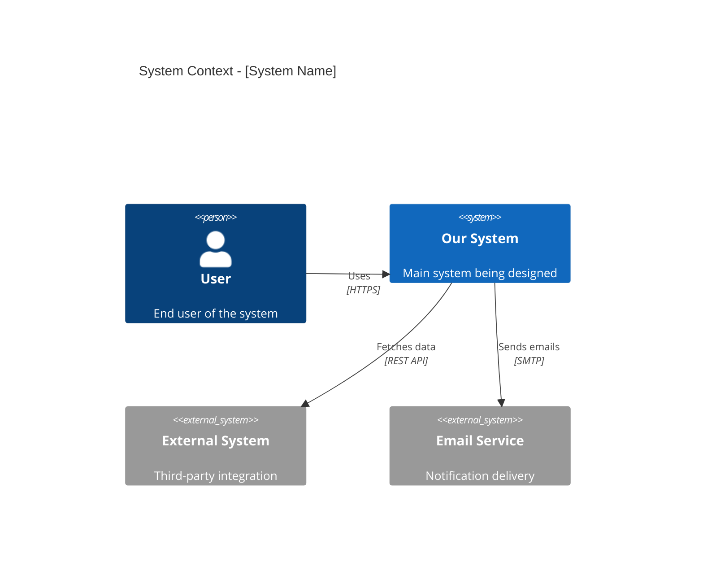
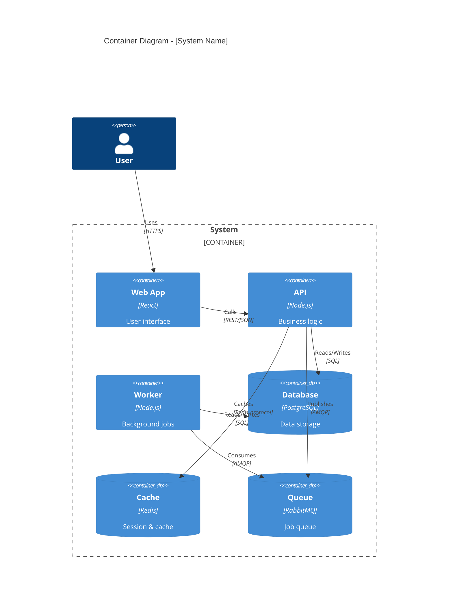
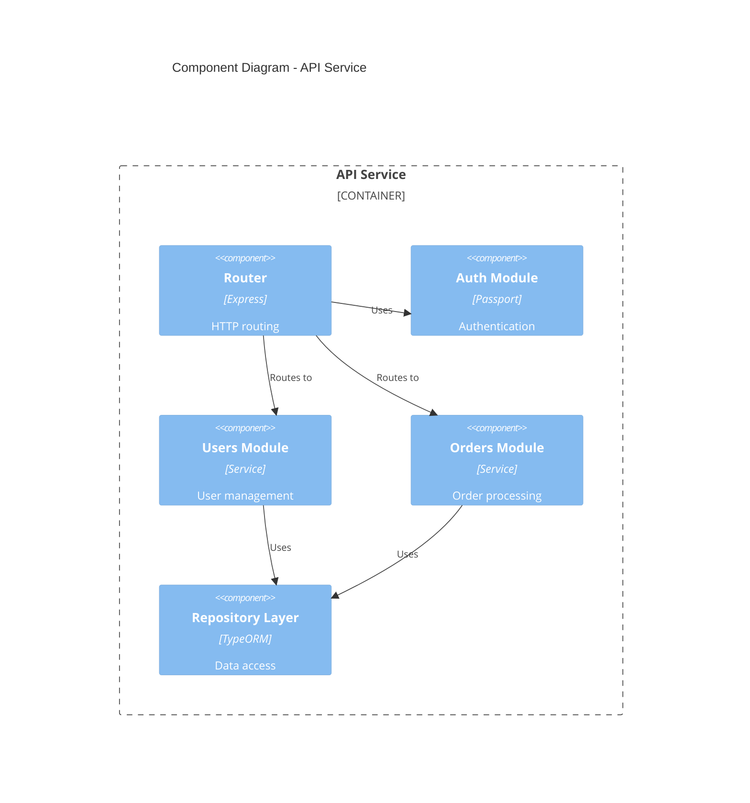
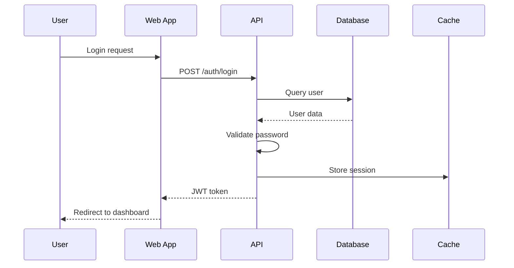
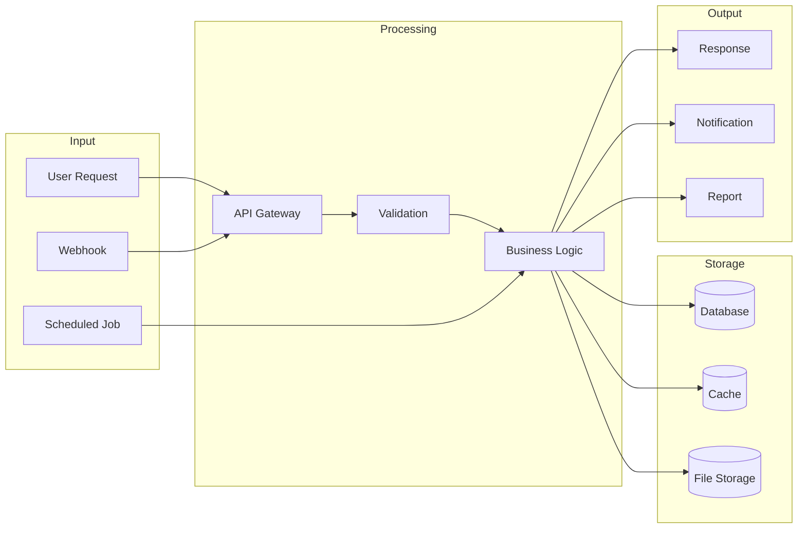
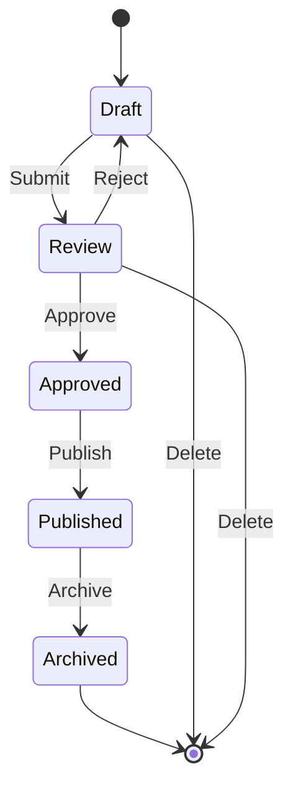
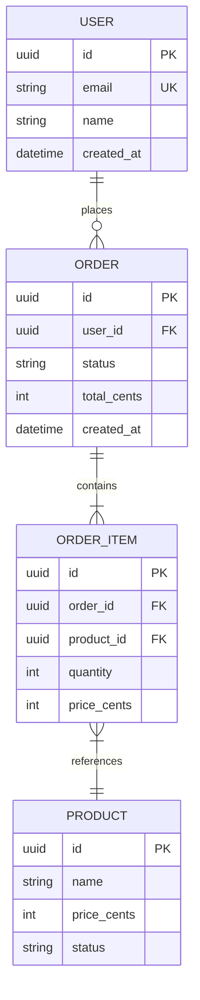
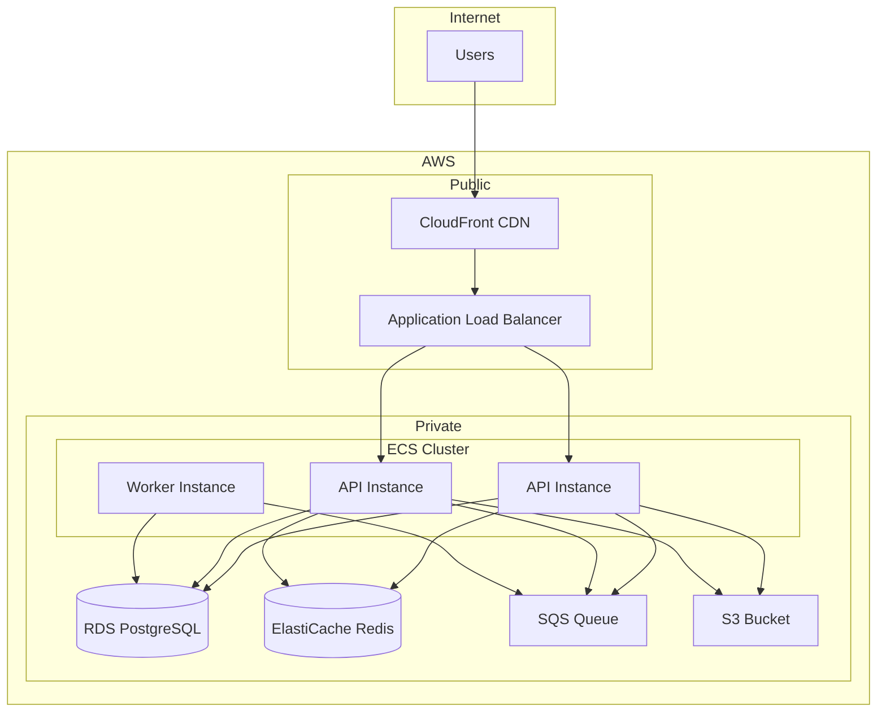

# Architecture Diagram Templates

## System Context Diagram

## Container Diagram

## Component Diagram

## Sequence Diagram

## Data Flow Diagram

## State Machine Diagram

## Entity Relationship Diagram

## Infrastructure Diagram (AWS Example)

## Diagram Selection Guide

| Scenario | Diagram Type |
|----------|--------------|
| High-level overview | System Context |
| Technical architecture | Container |
| Module structure | Component |
| API flow | Sequence |
| Data processing | Data Flow |
| Entity state | State Machine |
| Database schema | ER Diagram |
| Cloud setup | Infrastructure |
