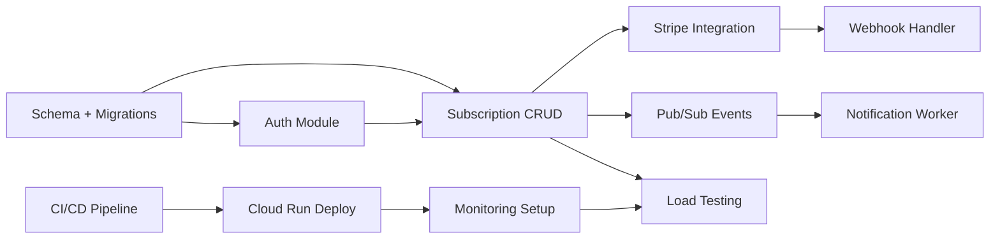
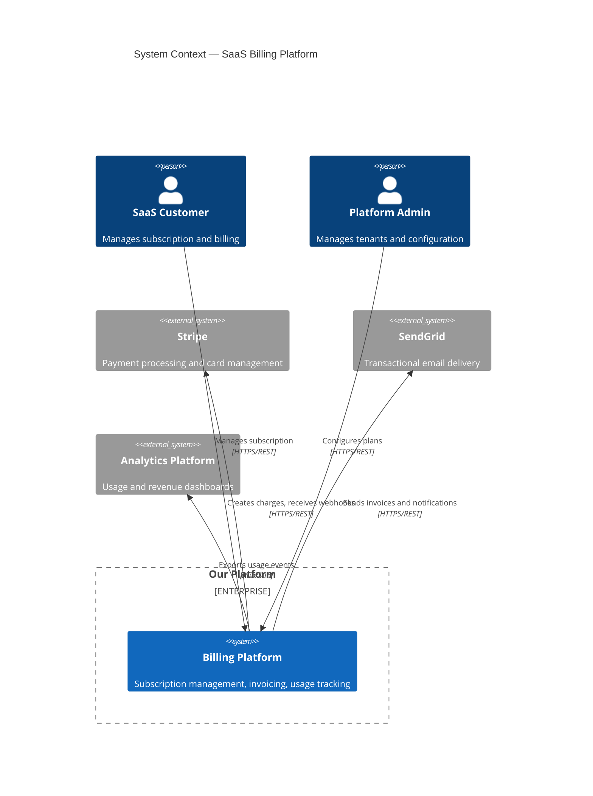
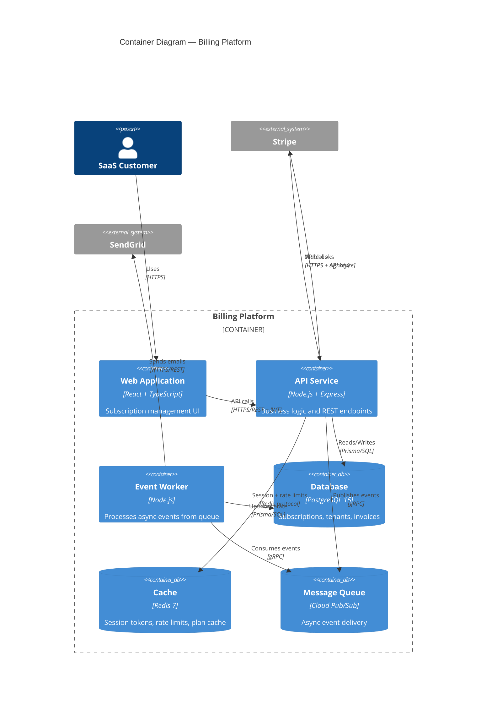
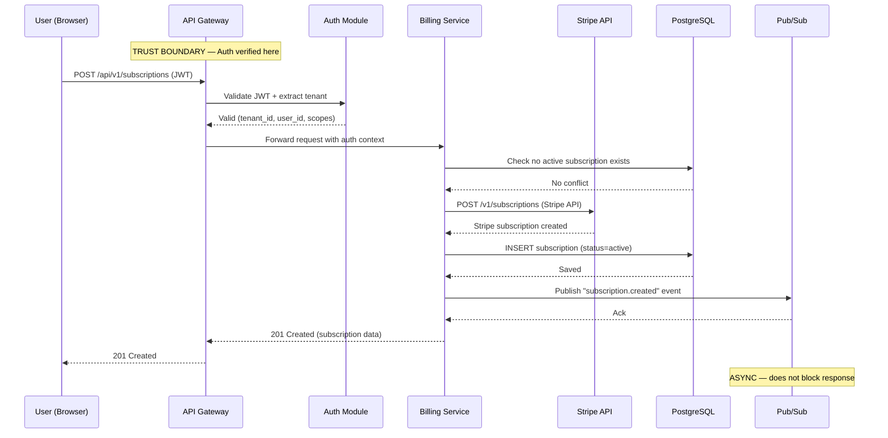

# Tech Spec Synthesizer — Reference Template

> **Purpose**: This template is injected into the Tech Spec Synthesizer agent's context.
> It defines the canonical 8-section structure, diagram conventions, synthesis rules,
> technology decision format, and anti-patterns the agent must follow when merging
> specialist outputs into a unified technical specification.

---

## How to Use This Template

The synthesizer receives outputs from multiple specialist agents (Data Modeler, System
Designer, Security Architect, API Designer, etc.). Each specialist output is tagged with
a source ID prefix:

| Specialist | ID Prefix | Example |
|-----------|-----------|---------|
| Data Modeler | `DM-` | `[DM-001]` Entity definitions |
| System Designer | `SD-` | `[SD-001]` Architecture patterns |
| Security Architect | `SEC-` | `[SEC-001]` Threat model |
| API Designer | `API-` | `[API-001]` Endpoint contracts |
| Infrastructure | `INF-` | `[INF-001]` Deployment topology |
| Performance Engineer | `PERF-` | `[PERF-001]` NFR targets |

The synthesizer merges these into a single spec using the 8-section structure below.
Every claim in the final spec MUST cite its source ID. Unsourced claims are flagged.

---

## 8-Section Tech Spec Structure

### Section 1: Executive Summary

**Purpose**: Give any reader — PM, developer, or exec — a complete picture in 2 minutes.

```markdown
# [Feature Name] — Technical Specification

## Document Info

| Field | Value |
|-------|-------|
| **Feature** | [Name] |
| **PRD Reference** | `docs/prd/YYYY-MM-DD-[feature].md` |
| **Author** | [Name / Agent] |
| **Date** | YYYY-MM-DD |
| **Status** | Draft / In Review / Approved |
| **Reviewers** | [List] |

## 1. Executive Summary

### 1.1 Problem Statement
[2-3 sentences. What user pain or business gap does this solve?
Trace directly to a PRD requirement.]

### 1.2 Solution Approach
[2-3 sentences. High-level technical approach — not implementation details.
Example: "Event-driven microservice that processes webhook payloads and
updates tenant billing state via an idempotent state machine."]

### 1.3 Key Technical Decisions

| # | Decision | Choice | Rationale | Source |
|---|----------|--------|-----------|--------|
| 1 | Primary datastore | PostgreSQL 15 | ACID for billing, JSONB for flexible metadata | [DM-001] |
| 2 | Communication pattern | Async events via Pub/Sub | Decouple billing from checkout flow | [SD-003] |
| 3 | Auth strategy | JWT + API key (machine-to-machine) | Human and service callers | [SEC-002] |

### 1.4 Technology Stack Summary

| Layer | Technology | Version |
|-------|-----------|---------|
| Frontend | React + TypeScript | 18.x |
| API | Node.js + Express | 20.x LTS |
| Database | PostgreSQL | 15.x |
| Cache | Redis | 7.x |
| Queue | Google Cloud Pub/Sub | — |
| Infrastructure | Google Cloud Run | gen2 |
| CI/CD | Cloud Build | — |
```

**Guidance for the synthesizer**:
- Do NOT repeat PRD requirements verbatim. Summarize the *technical* implications.
- Every decision in 1.3 must appear with full rationale in the Technology Stack Decision Log (see Section 9 appendix).
- If two specialists disagree on a decision, resolve it here and cite both: `"PostgreSQL over MongoDB [DM-001 vs SD-004] — resolved: relational model required for billing integrity."`

---

### Section 2: System Architecture

**Purpose**: Show how the system is structured, how components communicate, and where boundaries exist.

```markdown
## 2. System Architecture

### 2.1 Architecture Pattern
[Name the pattern and justify it.]

**Pattern**: Modular monolith with event-driven side-effects
**Rationale**: Team of 4 cannot operate microservices. Modular boundaries
enable future extraction. Events decouple billing from core flow. [SD-001]

### 2.2 Component Overview

| Component | Responsibility | Owner | Dependencies | Source |
|-----------|---------------|-------|-------------|--------|
| API Gateway | Rate limiting, JWT validation, routing | Platform | Cloud Run, Redis | [SD-002] |
| Billing Service | Subscription lifecycle, invoice generation | Billing team | PostgreSQL, Stripe API | [SD-003] |
| Notification Worker | Email/Slack dispatch from event queue | Platform | Pub/Sub, SendGrid | [SD-004] |
| Auth Module | Token issuance, session management | Platform | PostgreSQL, Redis | [SEC-001] |

### 2.3 Communication Patterns

| From | To | Pattern | Protocol | Why |
|------|----|---------|----------|-----|
| Client | API Gateway | Synchronous | HTTPS/REST | User-facing, needs immediate response |
| API Gateway | Billing Service | Synchronous | Internal HTTP | Same deployment unit |
| Billing Service | Notification Worker | Asynchronous | Pub/Sub event | Decouple: notification failure must not block billing |
| Notification Worker | SendGrid | Asynchronous | HTTPS/REST | Fire-and-forget with retry |

### 2.4 Deployment Topology

[See Architecture Diagram Guide below for the required Mermaid diagram.]

| Environment | Infrastructure | Scaling | Notes |
|------------|---------------|---------|-------|
| Development | Local Docker Compose | — | Mocked external services |
| Staging | Cloud Run (1 instance) | Manual | Connected to staging Stripe |
| Production | Cloud Run (2-10 instances) | Auto (CPU > 60%) | Multi-region TBD in v2 |
```

**Guidance for the synthesizer**:
- The component table is the spine of the spec. Every component mentioned anywhere else in the document MUST appear here first.
- Communication patterns must explicitly state synchronous vs. asynchronous and WHY.
- If `[SD-XXX]` proposes a component that `[SEC-XXX]` says needs additional controls, merge both into one row — do not create separate entries for the same component.

---

### Section 3: Data Architecture

**Purpose**: Define what data exists, how it flows, where it lives, and how it changes over time.

```markdown
## 3. Data Architecture

### 3.1 Entity Model

[Include Mermaid ER diagram — see Architecture Diagram Guide below.]

#### Entity: Subscription [DM-001]

| Field | Type | Constraints | Classification | Description |
|-------|------|-------------|---------------|-------------|
| id | UUID | PK, auto | internal | Unique identifier |
| tenant_id | UUID | FK tenants, NOT NULL | internal | Owning tenant |
| plan_id | UUID | FK plans, NOT NULL | internal | Current plan |
| status | ENUM | NOT NULL | internal | draft, active, past_due, cancelled |
| current_period_start | TIMESTAMPTZ | NOT NULL | internal | Billing period start |
| current_period_end | TIMESTAMPTZ | NOT NULL | internal | Billing period end |
| stripe_subscription_id | VARCHAR(255) | UNIQUE | confidential | External Stripe reference |
| created_at | TIMESTAMPTZ | NOT NULL, auto | internal | Creation timestamp |
| updated_at | TIMESTAMPTZ | NOT NULL, auto | internal | Last update timestamp |
| cancelled_at | TIMESTAMPTZ | NULL | internal | When cancellation was requested |

**Indexes**:
| Name | Fields | Type | Rationale |
|------|--------|------|-----------|
| idx_sub_tenant | tenant_id | B-tree | Tenant isolation queries |
| idx_sub_status | status | B-tree | WHERE status = 'active' filtering |
| idx_sub_stripe | stripe_subscription_id | Unique | Webhook deduplication |

### 3.2 Data Flow

1. **Ingress**: Stripe webhook -> API Gateway -> Billing Service
2. **Processing**: Validate signature -> Idempotency check -> State transition
3. **Storage**: PostgreSQL (source of truth) + Redis (cached plan limits)
4. **Egress**: Pub/Sub event -> Notification Worker -> User email

### 3.3 Storage Strategy

| Data Category | Store | Rationale | Retention | Source |
|--------------|-------|-----------|-----------|--------|
| Transactional (subscriptions, invoices) | PostgreSQL | ACID, relational integrity | Indefinite | [DM-002] |
| Session / cache | Redis | Low-latency reads, TTL expiry | 24h TTL | [DM-003] |
| File uploads | Cloud Storage (GCS) | Cost-effective blob storage | Per tenant policy | [INF-002] |
| Audit logs | BigQuery | Append-only, cheap at scale | 7 years (compliance) | [SEC-005] |

### 3.4 Migration Plan

| Step | Action | Reversible | Risk | Mitigation |
|------|--------|-----------|------|-----------|
| 1 | Deploy new schema (additive columns only) | Yes — drop column | Low | No data loss possible |
| 2 | Deploy application code (reads old + new) | Yes — revert deploy | Low | Feature flag |
| 3 | Backfill data for existing rows | Yes — re-run with old values | Medium | Dry-run in staging first |
| 4 | Remove old column references from code | No | Low | Only after 7-day bake |
| 5 | Drop old columns | No | Low | Backup before dropping |
```

**Guidance for the synthesizer**:
- Every entity must include a `Classification` column (public / internal / confidential / restricted) from `[SEC-XXX]`. If the Data Modeler did not provide classifications, flag as `UNCLASSIFIED — requires [SEC-XXX] input`.
- Migration plans must be expand-then-contract. Never drop before deploying new code.
- If `[DM-XXX]` defines a field and `[API-XXX]` exposes it, verify the types match. Type mismatches between data model and API contract are synthesis bugs.

---

### Section 4: API Architecture

**Purpose**: Define every external and internal interface — contracts that other teams and services will code against.

```markdown
## 4. API Architecture

### 4.1 Endpoint Overview

| Method | Path | Auth | Description | Source |
|--------|------|------|-------------|--------|
| POST | /api/v1/subscriptions | JWT (user) | Create subscription | [API-001] |
| GET | /api/v1/subscriptions/:id | JWT (user) | Get subscription details | [API-002] |
| PATCH | /api/v1/subscriptions/:id | JWT (user) | Update subscription (plan change) | [API-003] |
| DELETE | /api/v1/subscriptions/:id | JWT (user) | Cancel subscription | [API-004] |
| POST | /api/v1/webhooks/stripe | API key (Stripe signature) | Receive Stripe events | [API-005] |
| GET | /api/v1/billing/usage | JWT (user) | Current period usage | [API-006] |

### 4.2 Contract Detail (per endpoint)

#### POST /api/v1/subscriptions [API-001]

**Authentication**: Bearer JWT — scope `billing:write`
**Rate limit**: 10 req/min per tenant

**Request**:
```typescript
interface CreateSubscriptionRequest {
  plan_id: string;           // UUID of target plan
  payment_method_id: string; // Stripe payment method
  billing_cycle?: 'monthly' | 'annual'; // Default: monthly
}
```

**Response (201 Created)**:
```typescript
interface SubscriptionResponse {
  id: string;
  plan_id: string;
  status: 'draft' | 'active' | 'past_due' | 'cancelled';
  current_period_start: string; // ISO 8601
  current_period_end: string;
  created_at: string;
}
```

**Error responses**:
| Status | Code | Description | Logged | Error Strategy Ref |
|--------|------|-------------|--------|-------------------|
| 400 | VALIDATION_ERROR | Invalid plan_id or payment_method_id | No | Section 7.1 |
| 401 | UNAUTHORIZED | Missing or invalid JWT | Yes | Section 7.1 |
| 403 | FORBIDDEN | User cannot create subscriptions for this tenant | Yes | Section 7.1 |
| 409 | SUBSCRIPTION_EXISTS | Tenant already has active subscription | No | Section 7.1 |
| 502 | STRIPE_UNAVAILABLE | Stripe API unreachable | Yes | Section 7.2 |

### 4.3 Integration Points

| External System | Protocol | Auth | SLA | Fallback | Source |
|----------------|----------|------|-----|----------|--------|
| Stripe | HTTPS/REST | API key (secret) | 99.95% | Queue and retry (max 3) | [API-005] |
| SendGrid | HTTPS/REST | API key | 99.9% | Dead letter queue then manual | [SD-004] |
| Google Cloud Pub/Sub | gRPC | Service account | 99.95% | Local retry with backoff | [INF-003] |

### 4.4 Versioning Strategy

**Approach**: URL path versioning (`/api/v1/`, `/api/v2/`)

| Rule | Detail |
|------|--------|
| Breaking changes | New major version only |
| Additive changes | Allowed in current version (new optional fields) |
| Deprecation window | 6 months minimum |
| Sunset header | `Sunset: <date>` on deprecated endpoints |
| Migration guide | Required for each major version bump |

### 4.5 Auth Per Endpoint

| Endpoint Pattern | Auth Type | Required Scopes | MFA |
|-----------------|-----------|-----------------|-----|
| /api/v1/subscriptions/* | JWT (user) | billing:read or billing:write | No |
| /api/v1/webhooks/* | API key + signature verification | — | No |
| /api/v1/admin/* | JWT (user) + RBAC(admin) | admin:* | Yes |
```

**Guidance for the synthesizer**:
- Every error response in 4.2 MUST reference the error handling strategy in Section 7. If the API Designer did not provide error codes, cross-reference with the error strategy and fill them in. Flag as `[SYNTHESIZED — inferred from Section 7]`.
- Integration points (4.3) must match the component overview in Section 2.2. If a component talks to an external system, it appears in both places.
- Auth per endpoint (4.5) MUST be validated against Section 5 security architecture. Contradictions between `[API-XXX]` and `[SEC-XXX]` must be resolved explicitly.

---

### Section 5: Security Architecture

**Purpose**: Define how the system protects data, authenticates users, and mitigates threats.

```markdown
## 5. Security Architecture

### 5.1 Authentication Flows

#### User Authentication (Browser)
1. Client sends credentials to /auth/login
2. Server validates, issues JWT (15min) + refresh token (httpOnly cookie, 7d)
3. Client stores JWT in memory (NOT localStorage)
4. Subsequent requests use Authorization: Bearer header
5. Token refresh via POST /auth/refresh using cookie

#### Service-to-Service Authentication
1. Cloud Scheduler calls /api/v1/internal/jobs
2. Server validates GCP OIDC token
3. Checks audience claim matches service URL
4. Proceeds with system-level permissions

#### Webhook Authentication (Stripe)
1. Stripe sends event to /api/v1/webhooks/stripe
2. Server verifies stripe-signature header against webhook signing secret
3. Rejects if timestamp > 5 min old (replay protection)

### 5.2 Threat Model Summary [SEC-001]

| Threat | STRIDE Category | Impact | Likelihood | Mitigation | Status |
|--------|----------------|--------|-----------|------------|--------|
| JWT theft via XSS | Information Disclosure | High | Medium | CSP headers, no localStorage, httpOnly refresh | Mitigated |
| Stripe webhook forgery | Spoofing | High | Low | Signature verification + timestamp check | Mitigated |
| Tenant data leakage | Information Disclosure | Critical | Low | Row-Level Security (RLS) on all tenant tables | Mitigated |
| Brute force login | Spoofing | Medium | High | Rate limiting (5 attempts/15min), account lockout | Mitigated |
| SQL injection | Tampering | Critical | Low | Parameterized queries via Prisma ORM | Mitigated |

### 5.3 Data Protection [SEC-003]

| Data Element | Classification | At Rest | In Transit | Access Control |
|-------------|---------------|---------|-----------|---------------|
| User email | Confidential | AES-256 (DB encryption) | TLS 1.3 | Owner + admin |
| Payment method token | Restricted | Stripe-managed (never stored) | TLS 1.3 | Never accessed directly |
| Subscription status | Internal | DB encryption | TLS 1.3 | Owner + billing role |
| Audit logs | Internal | BigQuery default encryption | TLS 1.3 | Admin only |

### 5.4 Compliance Requirements [SEC-004]

| Requirement | Applies | Implementation | Owner |
|------------|---------|---------------|-------|
| PCI DSS | Yes (payments) | Stripe handles card data; we never see raw PANs | Stripe + Platform |
| GDPR | Yes (EU users) | Data export endpoint, deletion workflow, DPA with processors | Platform |
| SOC 2 Type II | Planned | Audit logging, access controls, encryption | Platform |
```

**Guidance for the synthesizer**:
- Auth flows in 5.1 MUST align with auth requirements in Section 4.5. If the Security Architect specifies JWT but the API Designer assumed session cookies, resolve the contradiction and document the resolution.
- Threat model entries from `[SEC-XXX]` should be checked against the API endpoints in Section 4. Every public endpoint should have at least one corresponding threat.
- Data classification from 5.3 must match the Classification column in Section 3.1 entity definitions. Mismatches are synthesis bugs.

---

### Section 6: Non-Functional Requirements

**Purpose**: Quantify performance, scalability, availability, and observability targets.

```markdown
## 6. Non-Functional Requirements

### 6.1 Performance Targets [PERF-001]

| Metric | Target | Measurement | Alert Threshold |
|--------|--------|-------------|-----------------|
| API response time (P50) | < 100ms | Application metrics | > 200ms |
| API response time (P95) | < 300ms | Application metrics | > 500ms |
| API response time (P99) | < 1000ms | Application metrics | > 2000ms |
| Webhook processing time | < 5s | Queue lag metric | > 15s |
| Database query time (P95) | < 50ms | Slow query log | > 100ms |

### 6.2 Scalability [PERF-002]

| Dimension | Current | Target (6mo) | Target (18mo) | Strategy |
|-----------|---------|--------------|---------------|---------|
| Concurrent users | 100 | 1,000 | 10,000 | Horizontal (Cloud Run auto-scale) |
| Subscriptions | 500 | 5,000 | 50,000 | Database indexing + read replicas |
| Webhook events/min | 50 | 500 | 5,000 | Pub/Sub + worker pool scaling |
| Storage (DB) | 1 GB | 10 GB | 100 GB | Partitioning + archival policy |

### 6.3 Availability [INF-001]

| Component | Target SLA | Downtime Budget (monthly) | Dependency SLA |
|-----------|-----------|--------------------------|---------------|
| API | 99.9% | 43 min | Cloud Run: 99.95% |
| Database | 99.95% | 22 min | Cloud SQL: 99.95% |
| Webhook processing | 99.5% | 3.6 hours | Pub/Sub: 99.95% |
| Overall system | 99.5% | 3.6 hours | Weakest link: webhook |

### 6.4 Observability [INF-002]

| Signal | Tool | Retention | Dashboard |
|--------|------|-----------|-----------|
| Application logs | Cloud Logging | 30 days | Yes |
| Request traces | Cloud Trace | 14 days | Yes |
| Custom metrics | Cloud Monitoring | 90 days | Yes |
| Error tracking | Sentry / Error Reporting | 30 days | Yes |
| Uptime checks | Cloud Monitoring | 90 days | Yes — with PagerDuty |
```

**Guidance for the synthesizer**:
- Performance targets from `[PERF-XXX]` must be achievable given the architecture in Section 2. If the architect chose synchronous calls but the performance engineer requires < 100ms P95 on a chain of 3 services, flag the contradiction.
- Availability SLA cannot exceed the weakest dependency SLA. Calculate and verify.
- Every metric in 6.1 must have a corresponding alert in Section 7.3.

---

### Section 7: Error Handling & Resilience

**Purpose**: Define how the system behaves when things go wrong — not just when they go right.

```markdown
## 7. Error Handling & Resilience

### 7.1 Error Classification & Strategy

| Error Class | HTTP Range | Retry | Log | Alert | User Message |
|------------|-----------|-------|-----|-------|-------------|
| Validation | 4xx | No | No | No (unless spike) | Specific field-level feedback |
| Authentication | 401 | No | Yes | If > 10/min per IP | "Session expired, please log in" |
| Authorization | 403 | No | Yes | If > 5/min per user | "You don't have permission" |
| Not Found | 404 | No | No | No | "Resource not found" |
| Rate Limited | 429 | Yes (after Retry-After) | Yes | If sustained | "Too many requests, try again in Xs" |
| Upstream Failure | 502/503 | Yes (exponential backoff) | Yes | Yes | "Service temporarily unavailable" |
| Internal Error | 500 | No | Yes | Yes (immediate) | "Something went wrong. ID: <request_id>" |

### 7.2 Degradation Strategy

| Dependency | Failure Mode | Degraded Behavior | Recovery |
|-----------|-------------|-------------------|----------|
| Stripe API | Timeout / 5xx | Queue subscription change, show "processing" to user | Retry with exponential backoff (max 3, then dead-letter) |
| Redis (cache) | Connection lost | Fall through to PostgreSQL direct queries | Auto-reconnect; log performance degradation |
| Pub/Sub | Publishing fails | Write event to local fallback table | Background job retries from fallback table every 60s |
| PostgreSQL | Connection exhausted | Return 503 with Retry-After header | Connection pool auto-recovery; alert on-call |

### 7.3 Monitoring & Alerting

| Signal | Condition | Severity | Action | NFR Reference |
|--------|-----------|----------|--------|--------------|
| Error rate (5xx) | > 1% of requests in 5 min window | Critical | Page on-call | Section 6.1 |
| Latency (P95) | > 500ms sustained 10 min | Warning | Slack notification | Section 6.1 |
| Stripe webhook lag | > 30s processing delay | Warning | Slack notification | Section 6.1 |
| Auth failures spike | > 5x baseline in 15 min | Critical | Page security on-call | Section 5.2 |
| Database connections | > 80% pool utilization | Warning | Slack + auto-scale investigation | Section 6.3 |
| Dead letter queue depth | > 0 messages for > 1 hour | Warning | Slack notification | — |

### 7.4 Recovery Procedures

| Scenario | Steps | RTO | RPO |
|----------|-------|-----|-----|
| Database failover | Automatic (Cloud SQL HA) -> verify connections -> clear cache | < 5 min | 0 (synchronous replication) |
| Corrupted deployment | Revert Cloud Run revision -> verify health checks -> notify team | < 10 min | 0 (stateless) |
| Stripe webhook backlog | Check dead-letter queue -> replay events in order -> reconcile state | < 1 hour | Events are idempotent |
```

**Guidance for the synthesizer**:
- Every alert in 7.3 must trace back to a metric in Section 6.1 or a threat in Section 5.2. Alerts without a corresponding NFR or threat are noise.
- Degradation strategy (7.2) must cover every external dependency listed in Section 4.3. Missing coverage means the spec is incomplete.
- Error responses in Section 4.2 must use the error classes defined in 7.1. If an API endpoint returns a 502, the degradation behavior must be documented here.

---

### Section 8: Implementation Roadmap

**Purpose**: Break the spec into deliverable increments with clear dependencies and risk mitigation.

```markdown
## 8. Implementation Roadmap

### 8.1 Sprint Breakdown

#### Sprint 1: Foundation (Week 1-2)
| Task | Dependencies | Estimate | Owner | Deliverable |
|------|-------------|----------|-------|-------------|
| Database schema + migrations | None | 3d | Backend | Prisma schema, migration files |
| Auth module (JWT issuance + validation) | Schema | 3d | Backend | Auth endpoints, middleware |
| Cloud Run deployment pipeline | None | 2d | Platform | cloudbuild.yaml, staging env |
| API skeleton with health check | Deployment pipeline | 1d | Backend | GET /health returning 200 |

#### Sprint 2: Core Billing (Week 3-4)
| Task | Dependencies | Estimate | Owner | Deliverable |
|------|-------------|----------|-------|-------------|
| Subscription CRUD endpoints | Auth module, schema | 4d | Backend | POST/GET/PATCH/DELETE endpoints |
| Stripe integration (create subscription) | Subscription endpoints | 3d | Backend | Stripe API integration |
| Webhook handler (signature verification) | Stripe integration | 2d | Backend | POST /webhooks/stripe |
| Unit + integration tests | All above | 2d | Backend | 80%+ coverage on billing module |

#### Sprint 3: Events & Polish (Week 5-6)
| Task | Dependencies | Estimate | Owner | Deliverable |
|------|-------------|----------|-------|-------------|
| Pub/Sub event publishing | Subscription endpoints | 2d | Backend | Event publishing on state changes |
| Notification worker | Pub/Sub | 3d | Backend | Email dispatch on subscription events |
| Monitoring + alerting setup | Deployment pipeline | 2d | Platform | Dashboards, alerts per Section 7.3 |
| Load testing + NFR validation | All endpoints | 2d | QA | Performance report vs. Section 6.1 |
| Security review | All code | 2d | Security | SAST/DAST scan results |

### 8.2 Dependency Graph



### 8.3 Milestones

| Milestone | Date | Criteria | Gate |
|-----------|------|----------|------|
| M1: API Live (staging) | Week 2 | Health check + auth + empty CRUD on staging | Demo to team |
| M2: Billing functional | Week 4 | Subscription lifecycle works end-to-end with Stripe test mode | PM sign-off |
| M3: Production ready | Week 6 | Monitoring live, load test passed, security review clean | Tech Lead + PM approval |

### 8.4 Risk Register

| Risk | Likelihood | Impact | Mitigation | Owner | Contingency |
|------|-----------|--------|------------|-------|-------------|
| Stripe API changes during development | Low | High | Pin API version (2024-12-18) | Backend | Abstract Stripe calls behind adapter interface |
| Performance miss on webhook processing | Medium | Medium | Load test early (Sprint 2) | QA | Switch to batch processing |
| Schema migration breaks existing data | Low | Critical | Expand-then-contract pattern, staging-first | Backend | Automated rollback in migration script |
| Team member unavailable | Medium | Medium | Document all decisions, pair on critical paths | PM | Adjust sprint scope, not timeline |
```

**Guidance for the synthesizer**:
- Sprint breakdown must be traceable. Every task should connect to a component in Section 2.2 or an endpoint in Section 4.1.
- The dependency graph must be consistent with the sprint ordering. Tasks cannot appear in Sprint 1 if they depend on Sprint 2 deliverables.
- Risks should be sourced from specialist outputs: `[DM-XXX]` for data risks, `[SEC-XXX]` for security risks, `[PERF-XXX]` for performance risks.

---

## Architecture Diagram Guide

All diagrams use Mermaid syntax for version-control friendliness and CI rendering.

### Diagram Selection

| What to Show | Diagram Type | When Required |
|-------------|--------------|---------------|
| High-level actors and systems | C4 Context | Always (Section 2) |
| Internal containers and data stores | C4 Container | Always (Section 2) |
| Module-level structure within a container | C4 Component | When a container has > 3 modules |
| Data entity relationships | ER Diagram | Always (Section 3) |
| Request/response flows | Sequence Diagram | For complex multi-step flows |
| State transitions | State Diagram | For entities with lifecycle (subscriptions, orders) |
| Task dependencies | Directed Graph | Always (Section 8) |

### Example 1: C4 Context Diagram

Shows the system in its environment — users, external systems, trust boundaries.



**Trust boundaries**: Draw a box around your system. Everything outside is untrusted. Auth is verified at the boundary (API Gateway).

### Example 2: C4 Container Diagram

Zooms into the system boundary. Shows deployable units, data stores, and protocols.



### Example 3: Sequence Diagram with Trust Boundaries

Shows a specific flow with clear auth verification points.



### Diagram Conventions

| Convention | Rule |
|-----------|------|
| Trust boundaries | Always labeled with a `Note` block |
| Auth verification points | Marked with dedicated step showing what is checked |
| External systems | Use `System_Ext` or suffix "(External)" |
| Data stores | Use `ContainerDb` or database cylinder shape |
| Async flows | Labeled explicitly; use dashed lines in sequence diagrams |
| Error paths | Include in sequence diagrams for critical flows (use `alt` blocks) |

---

## Synthesis Rules

These rules govern how the synthesizer merges specialist outputs into the unified spec.

### Rule 1: No Duplication — Summarize, Don't Copy

When specialist content belongs in the spec, **summarize and cite**.

**WRONG** (duplication):

Section 3.1 says "The subscription table has fields id, tenant_id, plan_id..." and then Section 4.2 says "The POST endpoint accepts plan_id and returns id, tenant_id, plan_id..." — same fields described twice with slightly different wording.

**RIGHT** (cross-reference):

Section 3.1 contains the full entity definition with all fields `[DM-001]`. Section 4.2 says "Request/response types map to the Subscription entity (Section 3.1). The response omits stripe_subscription_id (classified confidential)."

### Rule 2: Resolve Contradictions Explicitly

When two specialists disagree, the synthesizer MUST:
1. Identify the contradiction
2. Cite both sources
3. State the resolution and reasoning

**Resolution Block format**:

> **Contradiction resolved** [DM-003 vs SEC-002]:
> Data Modeler proposed storing Stripe customer IDs in plaintext.
> Security Architect requires all external identifiers be classified as confidential with encryption at rest.
> **Resolution**: Stripe customer IDs stored in encrypted column.
> Rationale: Low performance cost, high breach-impact reduction.

### Rule 3: Fill Integration Gaps

The synthesizer must verify cross-section consistency:

| Check | Sections Involved | What to Verify |
|-------|------------------|----------------|
| API errors match error strategy | 4.2 + 7.1 | Every HTTP error code in API contracts uses a class from 7.1 |
| Components match endpoints | 2.2 + 4.1 | Every endpoint is owned by a component in the overview |
| Data classifications match security | 3.1 + 5.3 | Entity field classifications align with data protection table |
| NFR alerts exist | 6.1 + 7.3 | Every performance target has a monitoring alert defined |
| Dependencies have fallbacks | 4.3 + 7.2 | Every external integration has a degradation strategy |
| Auth per endpoint matches auth flows | 4.5 + 5.1 | Auth types in API section are implemented in security section |
| Migration plan is expand-contract | 3.4 | No step drops before new code is deployed |
| Risks trace to sources | 8.4 | Each risk cites a specialist source |

When a gap is found, the synthesizer adds a `[SYNTHESIS GAP]` annotation:

> **[SYNTHESIS GAP]**: The SendGrid integration (Section 4.3) has no corresponding degradation strategy in Section 7.2. Added: "Queue failed emails to dead-letter table, retry every 5 min for 24h, then alert." [Synthesized — no specialist source]

### Rule 4: Cross-Reference Specialist IDs

Every factual claim in the final spec must cite its source:

**RIGHT**: "JWT tokens expire after 15 minutes [SEC-002] with refresh tokens stored in httpOnly cookies [SEC-003]."

**WRONG**: "JWT tokens expire after 15 minutes with refresh tokens stored in httpOnly cookies." (No source — reader cannot trace or verify)

Synthesized content (gap-filling) uses the notation `[Synthesized]` or `[Synthesized from SEC-002 + API-003]` when combining multiple sources.

### Rule 5: Preserve Specialist Precision

Do not generalize specialist recommendations:

**WRONG**: "The database should be encrypted."

**RIGHT**: "AES-256 encryption at rest via Cloud SQL default encryption. Field-level encryption for columns classified as 'restricted' using application-layer AES-256-GCM with Cloud KMS key rotation every 90 days. [SEC-003]"

---

## Technology Stack Decision Template

For each significant technology choice, document using this format. All decisions are collected in an appendix (Section 9) and summarized in Section 1.3.

```markdown
### Decision: [Category] — [Component Name]

| Field | Value |
|-------|-------|
| **Category** | Frontend / Backend / Database / Cache / Queue / Infrastructure / CI/CD / Monitoring |
| **Choice** | [Technology + version] |
| **Source** | [Specialist ID, e.g., DM-001, SD-003] |

**Alternatives Considered**:

| Alternative | Pros | Cons | Rejected Because |
|------------|------|------|-----------------|
| [Alt 1] | [Pros] | [Cons] | [Specific reason for this project] |
| [Alt 2] | [Pros] | [Cons] | [Specific reason for this project] |

**Rationale** (must be project-specific, not generic):
[Why this choice for THIS project's constraints, team, and requirements.]

**Trade-offs Accepted**:
- [What you are giving up by choosing this over alternatives]

**Reversibility**: [Easy / Medium / Hard — with explanation]
```

### Example: Database Decision

```markdown
### Decision: Database — Primary Datastore

| Field | Value |
|-------|-------|
| **Category** | Database |
| **Choice** | PostgreSQL 15 (Cloud SQL) |
| **Source** | [DM-001] |

**Alternatives Considered**:

| Alternative | Pros | Cons | Rejected Because |
|------------|------|------|-----------------|
| MongoDB Atlas | Flexible schema, easy horizontal scaling | No ACID for multi-document, weaker relational support | Billing data requires strict transactional integrity across subscriptions + invoices |
| CockroachDB | Distributed SQL, PostgreSQL-compatible | Higher cost, operational complexity for small team | Over-engineered for current scale (< 50K subscriptions). Revisit at 500K+ |
| Supabase (managed PG) | Built-in auth, realtime, REST API | Less control over extensions, vendor lock-in concerns | Team needs custom auth flow; existing Prisma setup works |

**Rationale**:
Billing data has strict relational integrity requirements (subscription to invoice to
payment). PostgreSQL ACID transactions, mature JSONB support for flexible metadata,
and team familiarity (3/4 engineers have PG experience) make it the clear choice at
current scale. Cloud SQL provides managed backups, HA failover, and IAM integration
that our 4-person team cannot operate manually.

**Trade-offs Accepted**:
- Single-region deployment limits availability to Cloud SQL SLA (99.95%)
- Vertical scaling ceiling around 10K TPS — acceptable for 18-month horizon
- No built-in full-text search — would need to add Elasticsearch/Typesense if
  search becomes a requirement

**Reversibility**: Hard — data migration and ORM rewrite required. Mitigated by
using Prisma ORM which abstracts some database-specific SQL.
```

---

## Common Synthesis Anti-Patterns

The synthesizer MUST detect and avoid these patterns. Each is a quality gate failure.

### Anti-Pattern 1: Verbatim Copy

**What it looks like**: Pasting specialist output into the spec without summarization or integration.

**Why it fails**:
- Creates a 50-page document nobody reads
- Contradictions between specialists are hidden, not resolved
- No cross-referencing between sections
- Reader must mentally merge the content themselves

**Fix**: Summarize each specialist contribution into the relevant section. Use cross-references: "Entity field classifications (Section 3.1) align with the data protection matrix (Section 5.3)."

### Anti-Pattern 2: Ignored Contradictions

**What it looks like**: Two specialists recommend different approaches and the synthesizer picks one without acknowledging the other.

**Example**: Section 2 says "Communication is synchronous REST" `[SD-001]` while `[PERF-001]` recommended async for webhook processing. No mention of the disagreement.

**Why it fails**:
- The losing specialist's reasoning is lost
- Reviewers cannot evaluate whether the right choice was made
- The contradiction may resurface during implementation

**Fix**: Use the Resolution Block format (see Synthesis Rule 2). Cite both sources. State what was decided and WHY.

### Anti-Pattern 3: Technology Without Justification

**What it looks like**: Listing technology choices without project-specific rationale.

**Example**: "We will use Redis for caching because it is fast and widely used."

**Why it fails**:
- "Fast and widely used" is true of many technologies
- No alternatives considered
- No trade-offs documented
- Impossible to evaluate if the choice is appropriate

**Fix**: Use the Technology Stack Decision Template above. Every choice must include: alternatives, project-specific rationale, trade-offs accepted, and reversibility assessment.

### Anti-Pattern 4: Missing Integration Points

**What it looks like**: Components are described in isolation without showing how they connect.

**Example**:
- Section 2: "Billing Service manages subscriptions"
- Section 4: "POST /api/v1/subscriptions creates a subscription"
- Section 7: "Failed payments are retried"
- No connection between API endpoint -> Billing Service -> retry mechanism

**Why it fails**:
- Developer building the Billing Service does not know it needs to publish events to the retry queue
- Error handling is disconnected from the API contract
- Integration test coverage will have blind spots

**Fix**: Every component in Section 2 must appear in at least one API endpoint (Section 4) OR event consumer description, one error/degradation scenario (Section 7), and one sprint task (Section 8). Orphaned components are a red flag.

### Anti-Pattern 5: Scope Creep via Spec

**What it looks like**: The spec adds features, endpoints, or components not in the PRD.

**Example**: PRD requires "Users can create and cancel subscriptions" but the spec adds admin dashboard with revenue analytics, coupon system, and multi-currency support.

**Why it fails**:
- Violates phase gate: Tech Spec implements PRD, not extends it
- Inflates estimates and delays delivery
- Untraceable requirements create testing gaps

**Fix**: Every Section 8 task must trace to a PRD requirement. If the synthesizer identifies a genuine gap (e.g., "PRD requires cancellation but does not specify refund behavior"), flag it: `[PRD GAP] Refund behavior on mid-cycle cancellation not specified. Assumed: Prorated refund. Requires PM confirmation.`

### Anti-Pattern 6: Inconsistent Naming

**What it looks like**: The same concept has different names across sections.

**Example**:
- Section 2: "Billing Module"
- Section 4: "Subscription Service"
- Section 7: "Payment Handler"
- All referring to the same component

**Why it fails**:
- Developers cannot cross-reference sections
- Creates confusion about whether these are 1 or 3 components
- Code review becomes impossible against the spec

**Fix**: Establish a glossary in Section 1 or an appendix. Use ONE canonical name per component, endpoint, and entity. The component table in Section 2.2 is the source of truth for names.

---

## Appendix: Synthesis Checklist

Before the synthesizer considers the spec complete, verify all items:

### Cross-Section Consistency
- [ ] Every component in Section 2.2 has at least one endpoint in Section 4.1
- [ ] Every entity in Section 3.1 has data classification matching Section 5.3
- [ ] Every endpoint error in Section 4.2 uses error classes from Section 7.1
- [ ] Every external dependency in Section 4.3 has a degradation strategy in Section 7.2
- [ ] Every NFR metric in Section 6.1 has a monitoring alert in Section 7.3
- [ ] Every auth type in Section 4.5 is implemented in Section 5.1
- [ ] Every sprint task in Section 8.1 traces to a component or endpoint
- [ ] Dependency graph in Section 8.2 is consistent with sprint ordering

### Source Traceability
- [ ] Every factual claim cites a specialist ID `[XX-NNN]`
- [ ] All synthesized content is marked `[Synthesized]` or `[Synthesized from ...]`
- [ ] All contradictions are resolved with Resolution Blocks
- [ ] All gaps are flagged with `[SYNTHESIS GAP]` annotations
- [ ] All PRD gaps are flagged with `[PRD GAP]` annotations

### Completeness
- [ ] All 8 sections are present and non-empty
- [ ] Technology Stack Decision Log contains all significant choices
- [ ] Architecture diagrams include: context (C4), container (C4), ER, and dependency graph
- [ ] Migration plan follows expand-then-contract pattern
- [ ] Risk register covers technical, security, and schedule risks

### Naming and Format
- [ ] Consistent component names across all sections (glossary matches Section 2.2)
- [ ] All Mermaid diagrams render without syntax errors
- [ ] Tables are properly formatted with headers
- [ ] No orphaned TODO or placeholder text remains
